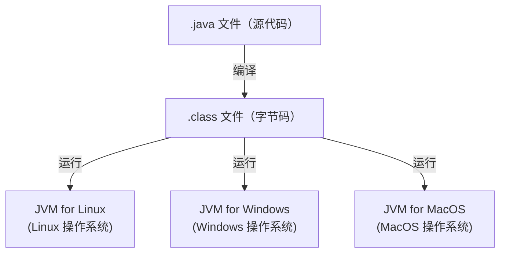

下面我们一起来认识一下 Java 这门语言：

### Java 技术体系

| 版本  | 全称                             | 定位    | 特点                       |
| --- | ------------------------------ | ----- | ------------------------ |
| 标准版 | Java SE（Java Standard Edition） | 桌面应用  | 完整的Java核心API             |
| 企业版 | Java EE（Java Standard Edition） | Web应用 | 一套企业级解决方案，包含Servlet、JSP等 |
| 小型版 | Java ME（Java Micro Edition）    | 移动应用  | 精简的Java API并加入移动端支持      |

 

### Java 核心：JVM

JVM（Java Virtual Machine，Java 虚拟机）：

1. JVM 是一个虚拟的计算机，可以执行 Java 字节码

2. 不同的平台有不同的 JVM，从而屏蔽底层运行平台的差异，实现跨平台执行 Java 代码（一次编译，到处运行）

 

### Java 运行机制

1. 用 javac 命令将源代码文件（.java）编译成字节码文件（.class）

2. 用 java 命令将字节码文件加载到 JVM 上执行


### Java 特点

1. 面向对象（OOP）

2. 健壮的：强类型机制、异常处理、垃圾自动回收机制

3. 跨平台：编译 java 生成的 class 文件可以在多个操作系统运行



4. 解释型语言：编译后的 class 文件不能直接被机器执行，需要 JVM 解释执行


### 区分 JDK 和 JRE

| 缩写  | 全称                       | 中文         | 定位                                | 内容                                      |
| --- | ------------------------ | ---------- | --------------------------------- | --------------------------------------- |
| JDK | Java Development Kit     | Java 开发工具包 | 面向 Java 开发者，用于开发 Java 程序（其中包含JRE） | JVM + 开发工具集（如 java、javac、javap、javadoc） |
| JRE | Java Runtime Environment | Java 运行环境  | 用于运行 Java 程序                      | JVM + Java核心类库                          |

 

### 常用 JDK 版本

> 使用LTS版本（Long Term Support，长期支持版本）

- java 8（最常用）

- java 11（常用）

- java 17

- java 21


### 安装 JDK

1. 下载：https://www.oracle.com/java/technologies/downloads
   
   > 注意：选择你想要安装的 JDK 版本和对应的操作系统

2. 安装：一直下一步即可
   
   > 注意：安装路径不要有中文和特殊字符，如 d:/program/jdk8

3. 配置环境变量：将 JDK 的 bin 路径（如 d:/program/jdk8/bin）添加到环境变量 path 中
   
   > 注意：一般将 JDK 安装路径保存在环境变量 JAVA_HOME 中，这样其 bin 路径可用 JAVA_HOME/bin 替代（不同操作系统添加环境变量的方式有所不同）
   > 
   > 目的：使得在任意目录都可以执行 JDK 包含的各种命令


### Java 开发工具

- Intellij IDEA（最常用，最强大）

- Visual Studio Code（通过安装插件支持java开发，轻量）


### Java 开发注事项

1. 源文件的基本组成是类（class）

2. 严格区分大小写

3. 语句以英文分号结束：`;`

4. 括号成对出现

5. 一个源文件最多一个 public 类

6. 如果一个源文件包含一个 public 类，则文件名必须以该类名命令

7. 非 public 类中可以写 main() 方法，指定运行该非 public 类时，入口方法是该非 public 类的 main() 方法
   
   > 举例说明：
   > 
   > ```bash
   > # 1.创建 Hello.java 源文件
   > public class Hello {
   >     public static void main(String[] args) {
   >         System.out.println("Hello world!");
   >     }
   > }
   > class Cat {
   >     public static void main(String[] args) {
   >         System.out.println("meow~");
   >     }
   > }
   > 
   > # 2.编译
   > javac Hello.java
   > 
   > # 3.运行
   > java Cat
   > 
   > # 结果
   > meow~
   > ```
